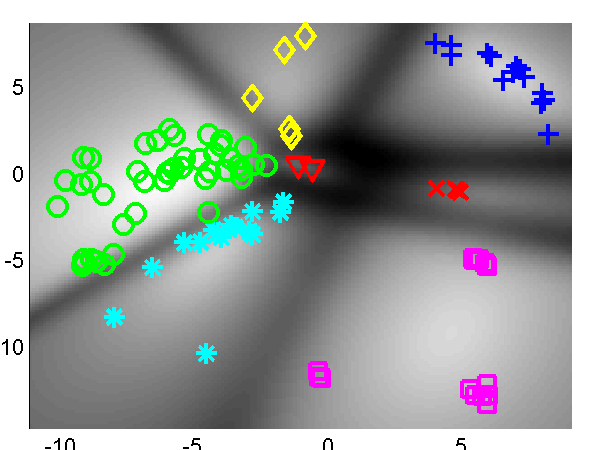
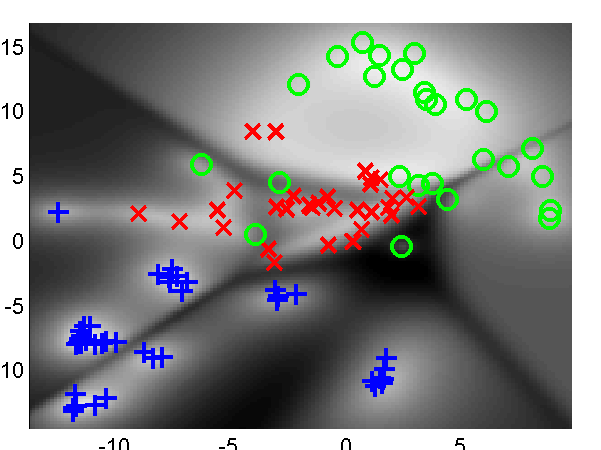
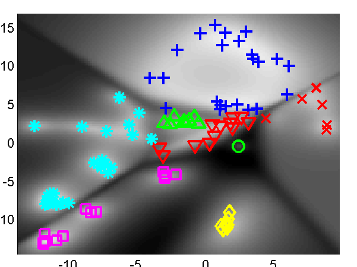
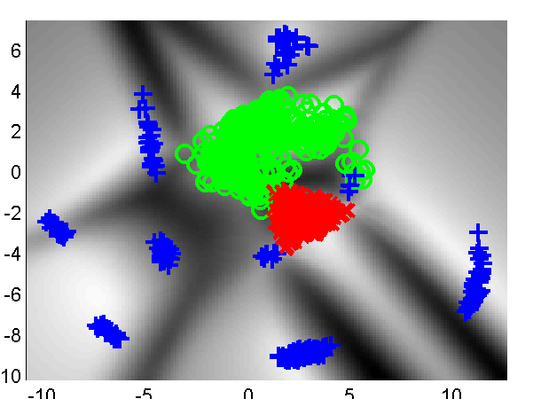
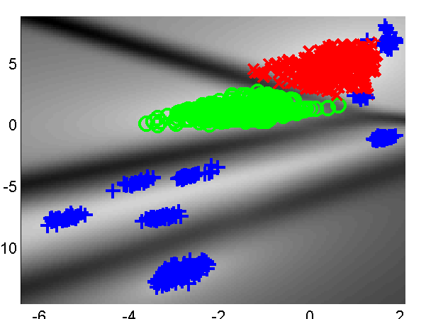
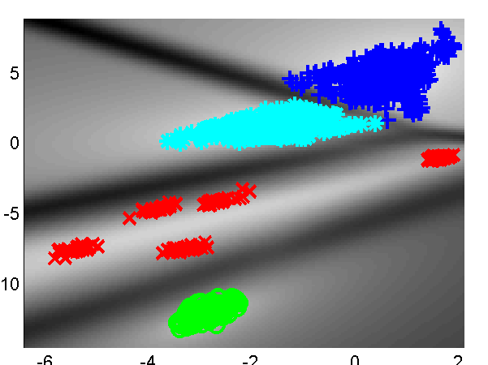
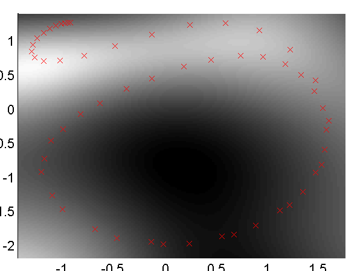
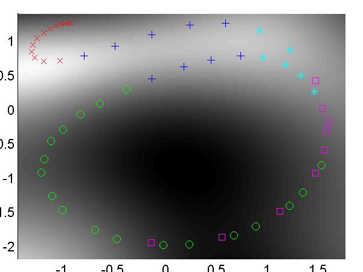
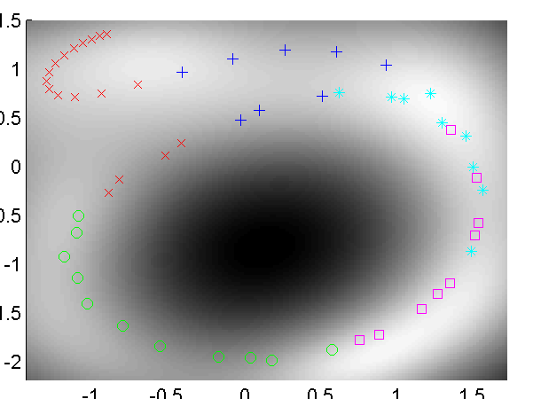

Mixtures of GP-LVM Software
===========================

This page describes examples of how to use the mixture of Gaussian process latent variable model Software (MGPLVM).

The MGPLVM software can be downloaded here.

Release Information
-------------------

**Current release is 0.12**.

As well as downloading the MGPLVM software you need to obtain the toolboxes specified below. 

| **Toolbox**                                                                | **Version** |
|----------------------------------------------------------------------------|-------------|
| [NETLAB](http://www.aston.ac.uk/eas/research/groups/ncrg/resources/netlab/ | 3.3         |
| [GPMAT](http://sheffieldml.github.io/GPmat/downloadFiles/vrs0p01)  | 0.01        |

This release was triggered by several requests and intereactions concerning mixtures of GP-LVMs.

### Version 0.11

This was the second release and was associated with an ICML 2008 submission.

### Version 0.1

This is the first release and was associated with a 2007 NIPS Submission.

Examples
--------

### Oil Data

The 'oil data' is commonly used as a bench mark for visualisation algorithms. For more details on the data see [this page](http://www.ncrg.aston.ac.uk/GTM/3PhaseData.html).

We first consider the performance of the algorithm at relatively low numbers of data points, taking 100 points from the full data set.

#### Mixtures of Principal Coordinate Analysers

The first example is run using `demOil1001.m`. It is a mixture of principal coordinate analysers (i.e. a mixture of GP-LVMs with linear kernels) using a gating network in the latent space. The model is initialised with 20 components. The results are shown in the figure below.

*Mixtures of GP-LVM on the reduced oil data using *Left*: linear kernels (Principal Coordinate Analysis, `demOil1001`) and *Right*: the assignments of the points to clusters.*

*Mixtures of GP-LVM on the reduced oil data using *Left*: linear kernels (Principal Coordinate Analysis, `demOil1001`) and *Right*: the RBF kernel (`demOil1002`).*

The second example replaces the linear kernels with radial basis function kernels. This can be run using `demOil1002.m`.

#### Full Oil Data

*Mixtures of GP-LVM on the full oil data using *Left*: linear kernels (Principal Coordinate Analysis, `demOil1`) (10 initial components) and *Right* the assignment of points to components.*

*Mixtures of GP-LVM on the full oil data using *Left*: linear kernels (Principal Coordinate Analysis, `demOil2`) (20 initial components) and *Right* the assignment of points to components.*

*Mixtures of GP-LVM on the full oil data using *Left*: RBF kernels, `demOil3`) (5 initial components) and *Right* the assignment of points to components.*

#### Stick Man Data

*Mixtures of GP-LVM on the full oil data using *Left*: linear kernels (Principal Coordinate Analysis, `demStick1`) (10 initial components) and *Right* the assignment of points to components.*

* Mixtures of GP-LVM on the full oil data using *Left*: linear kernels (Principal Coordinate Analysis, `demStick2`) (20 initial components) and *Right* the assignment of points to components.*

Page updated on Tue Mar 19 11:40:37 2013
